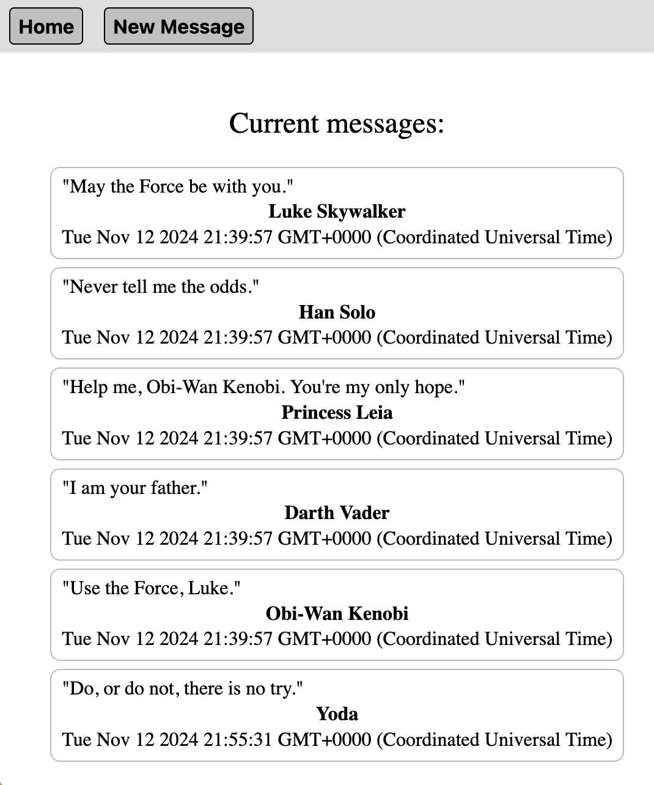

# Mini Message Board

## Table of Contents

- [Description](#description)
- [Installation Instructions](#installation-instructions)
- [Usage and Screenshots](#usage-and-screenshots)
- [Technologies Used](#technologies-used)
- [Dependencies and Credits](#dependencies-and-credits)
- [Project Structure](#project-structure)

## Description

This is a mini message board app built using Node.js, Express, and EJS.

## Installation Instructions

1. Clone or fork this repo
2. cd into the project root directory (where the README.md file is located)
3. Run the following in your terminal
    - ``` bash
      npm init -y
      npm install
      ```
    - ``` bash   
      CREATE DATABASE database_name;
      \c database_name
      \q
      code .env
      ```
1. <!-- node --> In the .env file 
   - ``` bash
     NODE_ENV=development
     TEST_DATABASE_URL="your_local_test_database_url"
     DATABASE_URL="your_local_database_url"
     SECRET_KEY="your_secret_key"
     ```
1. Set up the database per [these instructions](https://www.theodinproject.com/lessons/nodejs-using-postgresql)

## Usage and Screenshots



To view messge details click on a message. The "Home" button brings you back to the main page, and the "New Message" button lets you create a new message.

- [Link to live preview](https://mini-message-board-arav3n.onrender.com/)

### Features

- Stores messages in a database
- Lets anyone create new messages

## Technologies Used

### Frontend

- <a href="https://ejs.co/"> EJS </a>
- <a href="https://developer.mozilla.org/en-US/docs/Web/JavaScript"> JavaScript</a>
- <a href="https://developer.mozilla.org/en-US/docs/Web/HTML"> HTML</a>
- <a href="https://developer.mozilla.org/en-US/docs/Web/CSS"> CSS</a>

### Backend          
- <a href="https://nodejs.org"> Node.js</a>
- <a href="https://expressjs.com/"> Express</a>
- <a href="https://www.postgresql.org/"> PostgreSQL</a>

### Development Tools

- <a href="https://code.visualstudio.com/"> VS Code</a>
- <a href="https://www.npmjs.com/"> NPM</a>
- <a href="https://git-scm.com/"> Git</a>

### Hosting

- <a href="https://github.com/"> Github</a>
- <a href="https://neon.com/"> Neon</a>
- <a href="https://render.com/"> Render</a>


## Dependencies and Credits

### Package Dependencies

- [cors](https://www.npmjs.com/package/cors)
- [dotenv](https://www.npmjs.com/package/dotenv)
- [pg](https://www.npmjs.com/package/pg)

### Other Credits

- [Devicion](https://devicon.dev/)
- [Skillicons](https://skillicons.dev/)


## Project Structure

```bash
├──controllers/            # Controller files
├──db/                     # JavaScript files to perform CRUD actions on the database
├──models/                 # Link files
├──public/                 # Locally hosted image files
├──routes/                 # Router files
└──views/                  # EJS files
```
